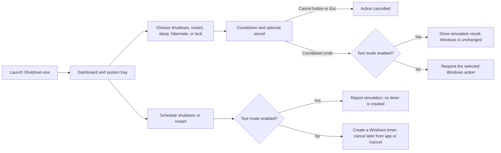

# Shutdown Utility Pro

[](https://github.com/Hariesh28/shutdown-utility-pro/actions/workflows/ci.yml)

A Windows desktop utility for shutdown, restart, sleep, hibernate, lock, and delayed shutdown/restart. Interactive actions use a cancellable countdown. **Test mode is enabled by default**, so you can explore the application without triggering Windows power actions.

> **Safety first:** Keep Test mode enabled while learning the app. Turning it off permits real actions that affect Windows. Save that change only when you mean to use the utility for real.

## Contents

- [Get started](#get-started)
- [Explore the app](#explore-the-app)
- [Configure settings](#configure-settings)
- [Use the command line](#use-the-command-line)
- [Install, start with Windows, and uninstall](#install-start-with-windows-and-uninstall)
- [Build from source](#build-from-source)
- [Files and data locations](#files-and-data-locations)
- [Troubleshooting](#troubleshooting)
- [Development and tests](#development-and-tests)
- [Project documentation](#project-documentation)

## Get started

### Option A: Download a release

1. Open [GitHub Releases](https://github.com/Hariesh28/shutdown-utility-pro/releases) and download the latest `ShutdownUtilityPro-<version>-windows.zip` and its `.sha256` checksum file.
2. (Recommended) Verify the downloaded archive. In PowerShell, from the download folder, run:

   ```powershell
   $archive = Get-ChildItem .\ShutdownUtilityPro-*-windows.zip | Select-Object -First 1
   $expected = (Get-Content "$($archive.FullName).sha256" -Raw).Trim().Split(' ')[0]
   $actual = (Get-FileHash $archive.FullName -Algorithm SHA256).Hash.ToLowerInvariant()
   if ($actual -ne $expected) { throw "Checksum mismatch for $($archive.Name)" }
   Write-Host "Checksum verified: $($archive.Name)"
   ```

   Run this in a folder containing the release ZIP and its matching `.sha256` file.
3. Extract the ZIP to a folder you control, for example `%LOCALAPPDATA%\Programs\ShutdownUtilityPro`. Keep the extracted files together; the EXE may use the adjacent configuration and sound files.
4. Run `Shutdown.exe`. The dashboard opens; on a fresh user profile, Test mode is on by default. Starting the app without arguments does **not** start a power action.
5. Try the countdown, cancel it with **Cancel** or **Esc**, and try the sound and schedule controls. In Test mode, power actions and schedules are simulated rather than sent to Windows.
6. To check the extracted package and this Windows profile, run `.\VerifyInstall.ps1` from the extracted folder. The self-test checks the executable, packaged safe-default configuration, and per-user data folder, then simulates supported actions and schedules. It does not send a real power request or create a Windows schedule.

### Option B: Build from source

**Requirements:** Windows and the .NET Framework 4.x C# compiler at one of these locations:

```text
C:\Windows\Microsoft.NET\Framework64\v4.0.30319\csc.exe
C:\Windows\Microsoft.NET\Framework\v4.0.30319\csc.exe
```

The built application runs on Windows with .NET Framework 4.6 or later. The project has no NuGet/package restore step.

```powershell
git clone https://github.com/Hariesh28/shutdown-utility-pro.git
Set-Location .\shutdown-utility-pro
.\Build.cmd
.\artifacts\Shutdown.exe
```

The build creates `artifacts\Shutdown.exe`, generates and embeds the app icon, copies `config\Shutdown.config` there, and includes optional sounds found in `assets\`. If the compiler is missing, install a .NET Framework developer pack that provides the compiler at one of the paths above, then retry.

## Explore the app

The dashboard is divided into power actions, countdown and sound controls, scheduling, and safety/convenience settings. The system-tray icon is available while the app is running; right-click it for quick actions, schedules, log access, and exit.



### Try a safe action

1. Launch `Shutdown.exe` and verify the dashboard banner says **TEST MODE**.
2. Set **Countdown (seconds)** to a small value and choose an action.
3. Cancel with the button or `Esc`, or let the countdown finish to see the simulation notice.
4. Test sound with the **Test** button. Test a schedule and confirm the app says it was simulated; no Windows timer is created while Test mode is on.

To enable real Windows actions, open **Safety & convenience**, uncheck **Test mode**, click **Save settings**, then accept the warning. The checkbox does not change the active mode until settings are saved; the header shows the active mode, and the note under the checkbox explains whether a change is pending. After real mode is enabled, countdown actions and schedules can affect Windows. To return to safe operation, check Test mode and save, or use the dashboard's **Reset defaults** button.

### Countdown and sound behavior

- Dashboard and tray actions use the configured countdown, from 1 to 3,600 seconds. The default is 3 seconds.
- An action-specific WAV beside the EXE takes precedence: `Shutdown.wav`, `Restart.wav`, `Sleep.wav`, `Hibernate.wav`, or `Lock.wav`. Otherwise the configured `SoundFile` is used.
- WAV playback uses Windows' `System.Media.SoundPlayer`. With **Wait for sound to finish** enabled, the countdown starts after playback; otherwise the sound and countdown run together.
- Missing or unreadable audio is logged but does not block an action.
- Interactive countdowns can be cancelled until the action begins with the **Cancel** button, **Esc**, or the window close button. Closing during sound playback also cancels the countdown. Shutdown/restart do not use the force-close (`/f`) option.

### System tray

The app uses a custom power/countdown icon in its title bar and notification area. Right-click the tray icon for **Open dashboard**, all five interactive actions, quick shutdown/restart schedules, **Cancel scheduled power action**, **Test sound**, **Open data folder**, **Open application folder**, **View log**, **About**, and **Exit**. Double-click the icon to reopen the dashboard. The icon label indicates when Test mode is enabled.

The tray schedules are fixed quick choices (30 seconds, 5 minutes, or 10 minutes). Use the dashboard schedule controls or command line for a custom delay.

## Configure settings

Most everyday settings are in the dashboard. Change them and click **Save settings**; they are saved for the current Windows user. **Reset defaults** restores safe defaults, including Test mode enabled.

| Dashboard setting | Default | What it does |
| --- | --- | --- |
| Countdown (seconds) | `3` | Delay before an interactive action; 1–3,600 seconds. |
| Sound file | `Shutdown.wav` | Fallback WAV when no action-specific file is present. Supports a path relative to the app folder or an absolute path. |
| Play sound | On | Play the selected WAV for an interactive action. |
| Wait for sound to finish before countdown | On | Start the countdown after WAV playback finishes. |
| Show tray notifications | On | Show informational balloon notifications. |
| Test mode | On | Simulate power actions and schedules without calling Windows to perform them. |
| Enable desktop-only hotkey | Off | Enables `Ctrl+Alt+Shift+S`; it is ignored unless the Windows desktop is foreground. |
| Start utility in the system tray | Off | Hide the dashboard after launch. |
| Close button hides to tray instead of exiting | On | Keep the app running in the tray when the dashboard is closed. Use tray **Exit** to quit. |
| Start with Windows (tray mode) | Off | Add/remove a current-user startup entry; no administrator access is requested. |
| Scheduled default minutes | `10` | Default dashboard scheduling delay; 1–10,080 minutes. |

The app saves mutable settings, logs, and window position under `%LOCALAPPDATA%\ShutdownUtilityPro`. The `config\Shutdown.config` file in the repository is the build-time seed copied next to the EXE; on first launch, that adjacent file is migrated into the per-user folder if no user configuration exists. Back up the per-user `Shutdown.config` before editing it directly, close the app first, and relaunch it to load file edits.

The configuration is plain text with one `Name=value` setting per line. Lines starting with `#` are comments. Booleans use `true` or `false`; integer values are bounded when read. Dashboard settings are best changed in the dashboard. The following supported settings can also be edited in the file:

> The configuration is user-editable, not a security boundary. Editing `TestMode=false` directly bypasses the dashboard's confirmation prompt. Use the dashboard for this safety-critical setting.

| Key | Default | Accepted value / behavior |
| --- | --- | --- |
| `CountdownSeconds` | `3` | Integer, 1–3,600. |
| `SoundFile` | `Shutdown.wav` | WAV path; relative paths resolve from the app folder. |
| `PlaySound` | `true` | Boolean. |
| `WaitForSound` | `true` | Boolean. |
| `ShowNotification` | `true` | Boolean. |
| `EnableDesktopOnlyHotkey` | `false` | Boolean; hotkey is guarded to the desktop foreground. |
| `Hotkey` | `Ctrl+Alt+Shift+S` | Modifier(s) plus one A–Z, 0–9, or F1–F24 key; the hotkey setting itself is file-only. |
| `StartInTray` | `false` | Boolean; hide the dashboard after launch. |
| `MinimizeToTray` | `true` | Boolean; minimize the dashboard to the tray. |
| `CloseToTray` | `true` | Boolean; closing the dashboard hides it instead of exiting. |
| `StartWithWindows` | `false` | Boolean; use the dashboard checkbox and **Save settings** to add/remove the current-user Run entry. Editing this key alone does not update the Windows startup registry. |
| `ConfirmScheduledActions` | `true` | Boolean; ask before creating a dashboard schedule. |
| `RememberWindowPosition` | `true` | Boolean; restore the saved window rectangle when a display still intersects it. |
| `DarkTheme` | `true` | Retained in the config format; the current interface uses its existing dark layout. |
| `TestMode` | `true` | Boolean; safety-critical setting. The dashboard asks before disabling it. |
| `ScheduledDefaultMinutes` | `10` | Integer, 1–10,080. |

**Sound and icon assets:** The build generates the branded multi-resolution `Shutdown.ico` from `scripts\GenerateAppIcon.ps1`, embeds it in the EXE, and copies it beside the executable for shortcuts and the tray icon. To regenerate it manually, run `powershell -ExecutionPolicy Bypass -File .\scripts\GenerateAppIcon.ps1`. Put optional `Shutdown.wav`, `Restart.wav`, `Sleep.wav`, `Hibernate.wav`, or `Lock.wav` files in `assets\` and rebuild; WAV files can also be selected with **Browse** in the dashboard.

## Use the command line

Run commands in PowerShell or Command Prompt from the repository root after building, or from the folder containing the released `Shutdown.exe`. Replace `.\artifacts\Shutdown.exe` with `.\Shutdown.exe` when running from the extracted release folder.

| Command | Result |
| --- | --- |
| `.\artifacts\Shutdown.exe` | Open the dashboard; does not initiate an action. |
| Desktop shortcut | Start the configured shutdown countdown directly, without opening the dashboard. The shortcut honors Test mode; when real actions are enabled, Windows closes apps normally and may display prompts for unsaved work. |
| `.\artifacts\Shutdown.exe /tray` | Launch the app; it opens the dashboard unless **Start utility in the system tray** is enabled. |
| `.\artifacts\Shutdown.exe /shutdown 5` | Start a 5-second cancellable shutdown countdown. |
| `.\artifacts\Shutdown.exe /restart 5` | Start a 5-second cancellable restart countdown. |
| `.\artifacts\Shutdown.exe /sleep 5` | Start a 5-second cancellable sleep countdown. |
| `.\artifacts\Shutdown.exe /hibernate 5` | Start a 5-second cancellable hibernate countdown. |
| `.\artifacts\Shutdown.exe /lock 3` | Start a 3-second cancellable lock countdown. |
| `.\artifacts\Shutdown.exe /schedule-shutdown 300` | Schedule shutdown in 300 seconds (5 minutes). |
| `.\artifacts\Shutdown.exe /schedule-restart 600` | Schedule restart in 600 seconds (10 minutes). |
| `.\artifacts\Shutdown.exe /cancel` | Ask Windows to cancel a pending native shutdown/restart timer. |
| `.\artifacts\Shutdown.exe /self-test` | Run installation diagnostics and simulated power-action checks without opening the dashboard. |
| `.\artifacts\Shutdown.exe /test-sound` | Play the configured shutdown sound. |
| `.\artifacts\Shutdown.exe /help` | Display command-line help. |
| `.\artifacts\Shutdown.exe /version` | Display the application version. |

The delay argument for countdowns must be a whole number from 1 to 3,600. For scheduled shutdown/restart it must be a whole number from 1 to 604,800 (7 days). Invalid values (including zero, negative, fractional, or out-of-range values) and unexpected extra arguments are rejected rather than silently adjusted. If omitted, an interactive command uses `CountdownSeconds`; a schedule uses `ScheduledDefaultMinutes`. Unknown commands display an error and help instead of opening the dashboard.

The dashboard remains single-instance. Explicit command-line actions (including `/cancel`) are handled independently, so they still work when the dashboard is already open or minimized to the tray.

The desktop shortcut created by either shortcut script passes `/shutdown`, so it starts the configured cancellable countdown without opening the dashboard. Countdown completion asks Windows to shut down without force-closing applications; open programs may block shutdown and display unsaved-work prompts. Test mode remains authoritative: while enabled, the shortcut only simulates shutdown.

**Force simulation for one launch** even when the saved setting allows real actions:

```powershell
.\artifacts\Shutdown.exe --test-mode /shutdown 3
.\artifacts\Shutdown.exe --test-mode /schedule-shutdown 300
```

`/test-mode`, `--test-mode`, and `/test` all force simulation for that process. `/cancel` is different: it sends Windows' native cancel request even in Test mode. It only cancels a pending Windows shutdown/restart timer; it does not create a timer or perform a power action.

## Install, start with Windows, and uninstall

These scripts act on the current user and do not require administrator privileges.

Create a desktop shortcut after building:

```powershell
powershell -NoProfile -ExecutionPolicy Bypass -File .\scripts\CreateDesktopShortcut.ps1
```

Build and create the standard **Shutdown Utility Pro** desktop shortcut in one step:

```powershell
powershell -NoProfile -ExecutionPolicy Bypass -File .\scripts\Install.ps1
```

The installer helper does not register the app to start with Windows. To enable startup, open the dashboard, select **Start with Windows (tray mode)**, then save. To have the window hidden at startup, also enable **Start utility in the system tray**. Disable the startup option in the dashboard or run the uninstall helper to remove the Run entry.

Remove the standard desktop shortcut and the current-user startup entry:

```powershell
powershell -NoProfile -ExecutionPolicy Bypass -File .\scripts\Uninstall.ps1
```

Uninstall does not delete the program folder, user settings, or logs. An optional `scripts\CreateInvisibleDesktopShortcut.ps1` creates a shortcut whose **icon remains visible but whose filename label is blank**; it does not hide the icon or change Windows registry settings. It saves through a temporary ASCII filename, applies the Unicode name, and notifies Explorer to refresh the Desktop. If the icon does not appear immediately, press **F5** while the Desktop is focused. If Windows or the desktop provider does not accept the invisible filename, the script falls back to a standard visible shortcut. The shortcut hotkey is deliberately blank.

**Cancel a native scheduled timer:** use the tray/dashboard **Cancel scheduled power action** command or run `.\artifacts\Shutdown.exe /cancel`. The interactive countdown's **Cancel** button or `Esc` cancels only that countdown.

## Build from source

Run `Build.cmd` from the repository root. It invokes the installed .NET Framework C# compiler, compiles a Windows GUI executable with the application manifest, and populates `artifacts\` with the EXE, configuration seed, and available assets.

```powershell
.\Build.cmd
```

For scripts and CI that should not pause at the end:

```powershell
.\Build.cmd /nopause
```

Close a running `Shutdown.exe` before rebuilding so Windows can replace the EXE. Distribute or relocate the **complete `artifacts\` folder**, not only the executable. Generated output is ignored by Git.

## Files and data locations

| Path | Purpose |
| --- | --- |
| `%LOCALAPPDATA%\ShutdownUtilityPro\Shutdown.config` | Per-user settings. |
| `%LOCALAPPDATA%\ShutdownUtilityPro\Shutdown.log` | Timestamped application events and errors; rotated at approximately 2 MB to `Shutdown.log.old`. |
| `%LOCALAPPDATA%\ShutdownUtilityPro\WindowState.txt` | Saved dashboard position and size. |
| `artifacts\` | Build output / distributable folder. Keep its files together. |
| `config\Shutdown.config` | Source configuration template copied into the build output. |
| `assets\` | Optional sound and icon files copied or embedded at build time. |

Legacy `Shutdown.config`, `Shutdown.log`, and `WindowState.txt` files beside the executable are copied into the per-user directory on first launch only when a corresponding user file does not already exist.

## Troubleshooting

| Issue | What to try |
| --- | --- |
| `Build.cmd` reports that the compiler was not found | Install a .NET Framework 4.x developer pack/compiler and confirm `csc.exe` exists at one of the paths listed under [Get started](#option-b-build-from-source). |
| A power action appears to do nothing | Check the dashboard and tray label for **TEST MODE**. In Test mode, the result is simulated by design. |
| Cannot find or play a sound | Use **Browse** and **Test**, confirm the file is a supported WAV, and keep the file beside the EXE or use an absolute path. Audio is optional. |
| Dashboard is not visible after launch | Check the notification area and tray overflow; double-click the app icon. **Start utility in the system tray** may be enabled. |
| Rebuild cannot replace `Shutdown.exe` | Exit the running app from the tray, then run `.\Build.cmd` again. |
| A scheduled shutdown/restart is still pending | Run `.\artifacts\Shutdown.exe /cancel`. This requests cancellation of Windows' pending native timer. |
| Need diagnostic details | Open **View log** from the tray or inspect `%LOCALAPPDATA%\ShutdownUtilityPro\Shutdown.log`. |

## Development and tests

Run the dependency-free regression suite on Windows:

```powershell
.\tests\ShutdownUtility.Tests\RunTests.cmd
```

The tests cover safe defaults, configuration parsing/persistence, delay bounds, and simulation of supported actions and schedules. They do not invoke shutdown, restart, sleep, hibernate, lock, or native scheduling. GitHub Actions builds the app and runs the regression suite for pushes and pull requests.

The application runs as the current user (`asInvoker`), does not request elevation, makes no network calls, and does not force-close open applications. Read [SECURITY.md](SECURITY.md) before reporting a vulnerability.

## Project documentation

- [Setup notes](docs/SETUP.md)
- [Command examples](docs/ExampleCommands.txt)
- [Release checklist](docs/RELEASE.md)
- [Security notes and reporting](SECURITY.md)
- [Contributing](CONTRIBUTING.md)
- [Support](SUPPORT.md)
- [Changelog](CHANGELOG.md)

## License

Licensed under the [MIT License](LICENSE.txt).
